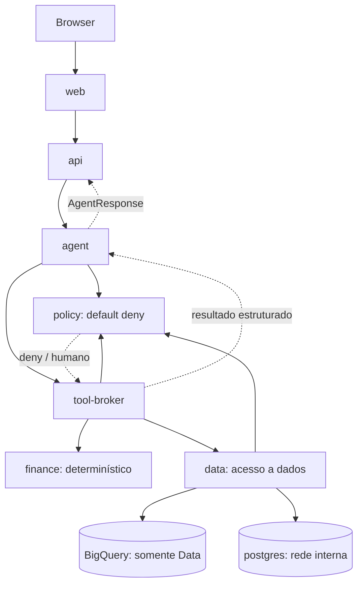

# Arquitetura ITA

Jornada DEMO/PostgreSQL certificada e modo competition integrado por contratos, identidade e policies. BigQuery entra somente por Data; o schema atual produz contexto incompleto, sem previsão inventada.

Cada seta de infraestrutura é uma rede privada de par de serviços. Não há rede interna comum a todos.
Agent não compartilha rede com Finance, Data ou PostgreSQL e não recebe seus arquivos/segredos.
Broker também não compartilha rede com PostgreSQL; Data é a única porta para o banco.
Policy independente impede autorização pelo Agent. API assina vínculo da sessão; Broker e Data reautorizam; Data autentica o Broker.

HTTP apenas interno, sem exposição de portas ao host salvo web em loopback. mTLS/identidade forte ficam para implantação externa;
não considerar rede Docker como autenticação de usuário final. Host/Docker daemon são parte da base confiável.
Observability é uma fronteira reservada com healthcheck; logs estruturados já existem, tracing/métricas completos na etapa 15.

O domínio será desacoplado do modelo, do framework e do provedor cloud. Nenhuma API real Itaú é presumida.
Google Drive não pertence à arquitetura. Voz e Tom pendente não gera conteúdo ou permissões por inferência.

Modo competition e limites de identidade: [ADR 0005](../adr/0005-authorized-competition-journey.md) e [operação](../demo/COMPETITION_RUNTIME.md).
