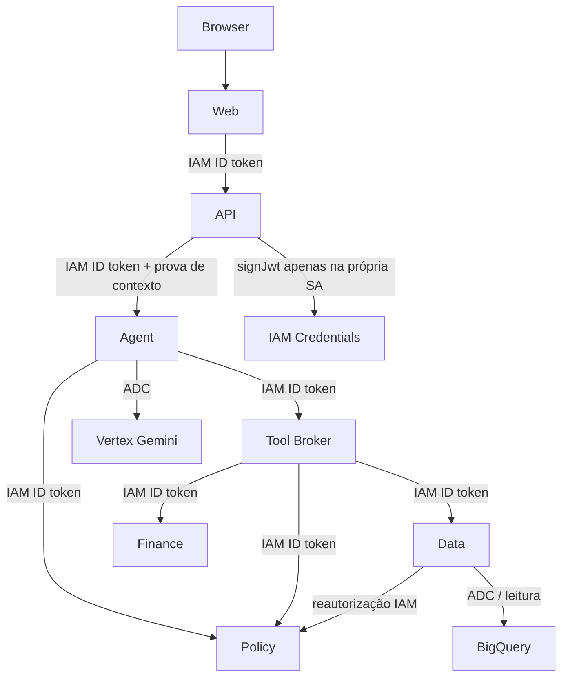

# Cloud Run target readiness

Esta é uma preparação autorizada do target final, não encerramento da etapa 16 nem implantação. Base desta continuação: main 39365558ec03a9a22c1730972ff38548847ea1bb. Stage 13 draft permanece separado; 14–18 continuam sujeitos aos gates oficiais.

## Estado da evidência

| Estado | Fato |
| --- | --- |
| CONFIRMADO pelo operador Google | Runtime final Cloud Run; projeto/região informados externamente; região us-central1 |
| CONFIRMADO pelo operador Google | run, aiplatform, artifactregistry, bigquery, iamcredentials, logging, monitoring, secretmanager habilitados; Vertex HTTP 200 e BigQuery acessível no Cloud Shell |
| CONFIRMADO pelo inventário informado | Cloud SQL/sqladmin e VPC Access/vpcaccess não habilitados; não são dependências |
| PREPARADO no repositório | Containers HTTP adaptados, IAM/token adapter, scripts Cloud Shell, testes sem GCP, desenho de identidades |
| AINDA NÃO TESTADO | IAM efetivo de cada SA, signJwt, org policies, push/digests no Google, startup Cloud Run, Secret Manager mount, cold starts e smoke real |
| BLOQUEADO operacionalmente nesta passada | Operações GCP no AGT (sem ADC e expressamente proibidas); próximo gate é criação isolada de nosso registry pelo operador |

Preflight real já aprovado pelo operador; [inventário sanitizado e estados atuais](GCP_EXTERNAL_RESOURCES.md). Recursos alheios são EXTERNAL_READ_ONLY; todos os nossos nomes usam ita-escossio.

Agent Engine/Agent Platform é opcional e não adotado. ModelProvider permanece substituível (`VertexGeminiProvider` / `MockProvider`).

## Serviços físicos existentes

| Compose | Cloud Run | Dependências e readiness |
| --- | --- | --- |
| web | ita-escossio-web | Conteúdo estático na imagem, proxy server-side para API; única entrada candidata a pública |
| api | ita-escossio-api | Chama Agent; registry externo; assina prova de cliente via IAM Credentials |
| agent | ita-escossio-agent | Policy/Broker e Vertex; sem BigQuery ou banco |
| policy | ita-escossio-policy | Regras na imagem, registry externo e certificados públicos do signer; sem BigQuery/Vertex |
| tool-broker | ita-escossio-broker | Chama Policy, Data, Finance; não executa query diretamente |
| data | ita-escossio-data | Modo bigquery/ADC; chama Policy; registry externo, nenhuma persistência local |
| finance | ita-escossio-finance | Cálculo puro; sem dados persistentes ou permissões de APIs GCP |
| observability | não implantado inicialmente | Container existente é somente endpoint de saúde, não collector. PORT/read-only/SIGTERM verificáveis; Cloud Logging coleta stdout dos sete serviços |
| postgres | DESENVOLVIMENTO/TESTE LOCAL | Stateful, não Cloud Run ready; necessário apenas à jornada DEMO PostgreSQL |
| secrets-init | DESENVOLVIMENTO/TESTE LOCAL | Job Compose grava volumes/chaves locais; não é serviço Cloud Run, não é implantado |

A jornada de competição não utiliza PostgreSQL. Data recusa modo postgres no Cloud Run; não existe fallback. Não criar Cloud SQL nem substituto. Artefatos estáticos/fixtures na imagem não são filesystem persistente; apenas arquivos estáticos são lidos. O registry é configuração privada montada pelo Secret Manager, não um volume do host nem armazenamento mutável da aplicação.

Todos os oito containers HTTP usam 0.0.0.0 e PORT (default local 8080), usuário não-root, stdout JSON, `/healthz`, SIGTERM e saída limpa. Certificação de worker inicia cada imagem em PORT=9091, filesystem read-only, sem volumes, sem rede, inclusive Data em bootstrap bigquery sem chamada externa. Não há Docker socket/IP fixo/hostname de AGT. Chamadas locais usam DNS Compose; em ITA_PLATFORM=cloudrun só URLs HTTPS canônicas `*.run.app` configuradas são aceitas, sem fallback localhost. Health comprova processo/configuração de startup, não IAM/modelo/dados disponíveis.

## Fluxo e autenticação

`ITA_<SERVICE>_URL` vem de status.url, sem barra final/caminho; audience é exatamente essa URL. ID tokens são obtidos com identidade nativa do runtime. X-Serverless-Authorization autentica no proxy Cloud Run; X-ITA-Service-Identity conserva o token completo para verificação adicional de assinatura, issuer, audience, expiração e caller. O header Authorization do usuário permanece separado. Headers de identidade externos nunca são repassados cegamente. Falha de emissão/verificação impede execução.

Policy não confia em contexto decidido pelo Agent. A API assina uma prova de 30s por IAM signJwt, com customer/session hash/correlation/window/valor; Policy verifica a chave pública Google da SA API e os mesmos vínculos existentes. Não é autenticação service-to-service: IAM continua obrigatório em todas as arestas. No cloud nenhuma chave HMAC compartilhada substitui IAM e nenhuma chave privada é criada/montada. No Compose, HMAC local permanece para regressão isolada.

Bootstrap em duas fases, ingress sem VPC e comandos em [cloudrun/README](../../infra/gcp/cloudrun/README.md). Registry usa versão numérica de Secret Manager por revisão: revogar cliente exige publicar nova versão e atualizar/revalidar API/Policy/Data; drenar revisões antigas antes de admitir tráfego. Não alegar revogação instantânea distribuída. Provas já emitidas expiram em 30s. Cache local de tokens/certs não é fonte de autoridade persistente. Limites de deadline/cold-start podem gerar falha fechada; precisam de medição no smoke real antes de ajustar TTL/timeouts.

## Logs e telemetria

Eventos estruturados saem em stdout/stderr e são compatíveis com jsonPayload do Cloud Logging. correlation_id é preservado pelo fluxo e audit trail existente; nenhum header Authorization/token/ADC/registry ou extrato completo é logado. Não há exporter dependente de filesystem. Logging/Monitoring habilitados não significa que dashboards/alertas/traces OTel estejam implementados: isso permanece no gate da etapa 15. Adicionar integração OTel e vínculo ao trace Cloud em etapa própria, sem substituir correlation ID.

Referências técnicas: [contrato de container](https://docs.cloud.google.com/run/docs/container-contract), [autenticação entre serviços](https://docs.cloud.google.com/run/docs/authenticating/service-to-service), [IAM signJwt](https://docs.cloud.google.com/iam/docs/reference/credentials/rest/v1/projects.serviceAccounts/signJwt). A verificação local não comprova comportamento dessas APIs no projeto do hackathon.
